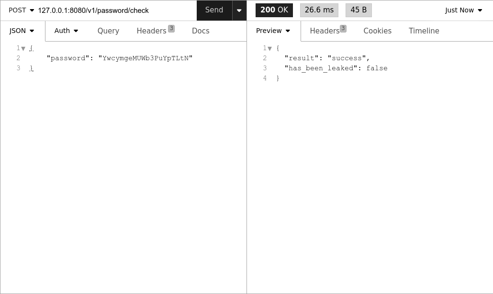

# Leaked Passwords Checker

**Leaked Passwords Checker** is a self-hosted microservice designed to check whether a password has been leaked in known data breaches. It provides a simple and straightforward API endpoint for integration with other services.

This tool helps you enhance security by preventing users from using compromised passwords. It’s specifically useful for **preventing the re-usage of leaked passwords during account creation, update or password reset** which improves IT security across your apps, websites and web services.

The data is provided by the HaveIBeenPwned service as a one-time download using their public API.

## Features

- Checking against a downloaded database ensures privacy and security by not having to send passwords outside of your infrastructure.
- API-First Design: a RESTful API endpoint that integrates seamlessly with your services.
- Compliance: passwords are checked against hashes; nothing is stored in plain text.

The service is supposed to be running behind nginx Nginx or similar proxies for production use. This is up to you to configure it (I might add Nginx configuration later).

## Getting Started

### Prerequisites

- Linux
- Golang 1.23.3
- SQLite 3
- Docker (optional)

### Installation

1. **Clone the Repository**:
   ```bash
   git clone https://github.com/stepcodebox/leaked-passwords-checker.git
   cd leaked-passwords-checker
   ```

2. **Set Up the Service**:
   The following script creates the SQLite database, generates an API key, creates a sample config file and an empty log file:
   ```bash
   ./scripts/setup.sh
   ```

3. **Build the Service**:
   The following script builds both the service and the downloader of the HaveIBeenPwned database:
   ```bash
   ./scripts/build.sh
   ```

4. **Download the HaveIBeenPwned Database**:
   ```bash
   ./scripts/download.sh
   ```

4. **Run the Service**:
   ```bash
   ./scripts/run.sh
   ```

### Usage

The service runs on `http://localhost:8080` by default.

Use the API key generated by the setup.sh script as X-API-Key header with your requests.

   Example of a request:

   ```bash
   curl -X POST http://localhost:8080/v1/password/check --header "Content-Type: application/json" --header "X-API-Key: XXXXXXXXXXXXXXXXXXXX" -d '{"password": "yourpassword"}'
   ```

### Deployment with Docker

To build and run use the included Docker Compose configuration.

   ```bash
   ./infra/start.sh
   ```

To access the service use the API will be available at `http://localhost:8080/v1/password/check` with a demo API key "test".

## API Reference

### Endpoint: `POST /v1/password/check`

#### Request Body

```json
{
    "password": "yourpassword"
}
```

#### Response

```json
{
    "result": "success",
    "has_been_leaked": true
}
```

- `has_been_leaked`: `true` if the password is found in the database, `false` otherwise.




## Contributing

Contributions are welcome! Feel free to submit a pull request or open an issue to report bugs or suggest new features.

## Author

**Stephen Stephenson**  
Email: [stephenson.inbox@gmail.com](mailto:stephenson.inbox@gmail.com)  
GitHub: [stepcodebox](https://github.com/stepcodebox/)

Feel free to reach out with questions, suggestions or feedback.

## License

This project is licensed under the [MIT License](LICENSE).